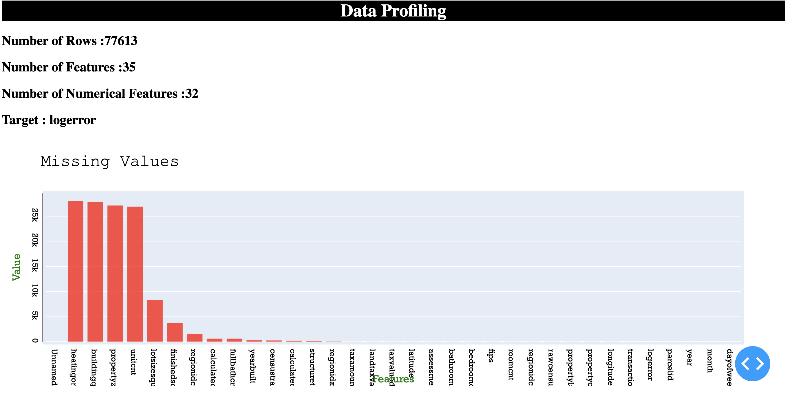

# Data Profiling Dashboard
Minimalistic dashboard framework to have a quick look to the structured data

## Features
- Currently dashboard shows three three sections - Missing Values, Categorical Data,  Numerical Data
- Highly adaptable to new data with little to no configuration.

## Technical Details
- It is built using plotly dash libary along with data manipulation using pandas and numpy
- It is developed in dockerized environment and can be easily deployed to google kubernetes cluster using the configs in k8s.

## How to Use
  - Add the train.csv in the base_data directory 
  - pip install -r requirements.txt
  - Run dashboard.py
 
